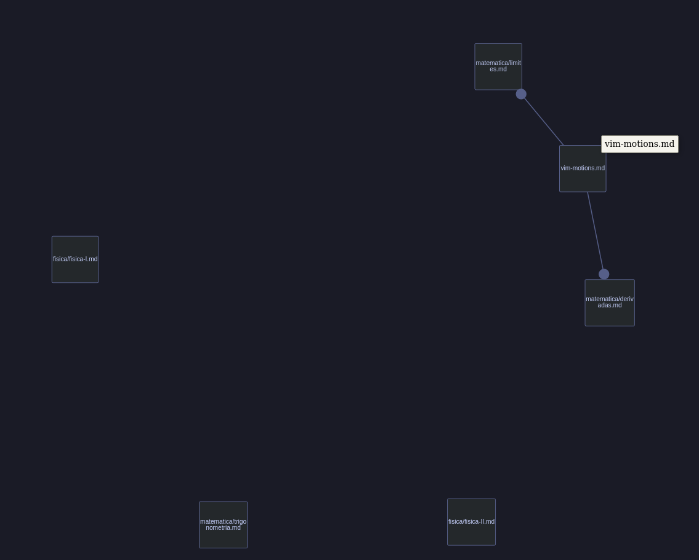
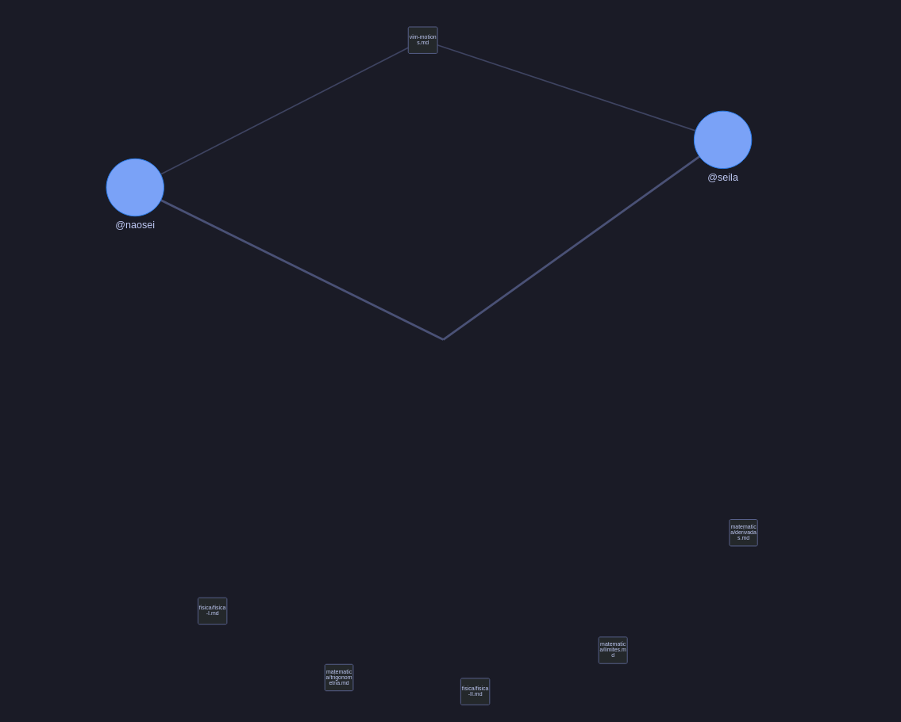

# TOT - Gerador de grafos CLI
## Descrição:
O tot é um aplicativo CLI feito para gerar gráficos a partir de arquivos Markdown em um vault com o prefixo ".tot", pode gerar gráficos de acordo com os links ou tags de cada nota. 

---
## Instalação:
### Com pip:
```bash
# clona o repo na pasta que preferir
git clone https://github.com/rry-monteiro/tot.git
cd tot
# usa o pyinstaller pra transformar em binário ou .exe
pip install pyinstaller
pyinstaller tot.spec
# copia pro local
```
### Com UV:
```bash
#clona o repo na pasta que preferir
git clone https://github.com/rry-monteiro/tot.git
cd tot
uv sync
#adiciona como dev
uv add --dev pyinstaller
uv run pyinstaller tot.spec
```
- **seu .exe ou binário se econtra em ```./dist/``` com o nome ```tot```**
----
## Uso:
### Sintaxe esperada:
**Tags** — bloco `tags:` no início do arquivo:
```Markdown
---
tags: [rust, linux, hardware]
---
```
**Links** — sintaxe Markdown padrão pra arquivos `.md`:
```Markdown
Veja também [minha outra nota](subpasta/outra.md)
```
- **Perceba que o tot não espera que você aprenda uma sintaxe nova para usa-lo, apenas usa o que ja existe no Markdown ;)**

### Vault:
```
Documentos/
└── meu_vault.tot/          ← pasta com sufixo .tot
    ├── nota_a.md
    ├── nota_b.md
    └── subpasta/
        └── nota_c.md
```
O tot espera uma pasta com o sulfixo .tot em algum lugar na pasta `~/Documentos`, garanta que ela exista antes de usar o tot.

Seu aruivo html será criado em `~/Documentos/nome_do_seu_vault.tot.<modo>.html`, exemplo:
- `meu_vault.tot.links.html`
- `meu_vault.tot.tags.html`


### Comandos:

|comando|descrição|
|-|-|
|`tot links`| gera o gráfico de links do seu vault|
|`tot tags`| gera p gráfico de tags do seu vault|
|`tot all`| gera os dois gráficos com nomes diferentes|
|`tot [modo] -f`| flag que gera o grafico independente das mudanças|

---
## Capturas de tela:
### Gráfico de links



### Gráfico de tags


---
## Como funciona por baixo

1. **Cache inteligente** — DocumentManager mantem um JSON com dados (mtime, hash Blake2b, tags, links) de cada aruqivo no vault, quando recebe um comando, verifica se o mtime mudou, caso mude, calcula o hash do arquivo, caso ele tenha mudado, só aí varre o documento com regex. A etapa do mtime é pra não calcular hash todas as vezes.
2. **Regex leve** — extrai tags e links com padrões pré-compilados, sem parser Markdown pesado, sem fazer isso sempre que for gerar um gráfico.
3. **Geração de HTML** — os geradores montam a estrutura de nós/arestas e injetam no template vis-network. Nenhum html é gerado do zero, o template está embutido nos arquivos em `nethtml.py`. A ideia é economizar tempo com a geração do gráfico.
4. **Física** — Os nós no gráfico fazem de tudo pra não se esbarrar, chega a ser um pouco difícil tornar o gráfico bagunçado. Caso queira ver como foi ajustada a física, abra `nethtml.py`

--- 
## sobre
### Ideia:
A ideia de criar o tot surgiu do [Obsidian](https://obsidian.md/), a ideia inicial era fazer um gráfico apenas de frases que se conectam por chaves (usando a sintaxe do obsidan `[[arquivo]]`) para estudo, acabei percebendo que papel e caneta me ajudaria mais nisso e resolvi esquecer (depois de pronto). Depois de um tempo comecei a me interssar mais pelo pyvis e percebi que podia sair algo muito bom de lá, então comecei outra vez.
### Thoth:
[Tote](https://pt.wikipedia.org/wiki/Tote) é um deus egípcio da lua,do conhecimento, da **sabedoria, da escrita**, da música e da magia. Acho importante que as pessoas gostem de escrever e estudar, acumular e aplicar conhecimento, um gráfico de tags e links, mesmo que seja simples, incentiva (pelo menos a mim) a voltar a estudar, ver onde seus estudos e suas anotações se esbarram, ter algo mais visual ou palpável das suas anotações e conhecimentos é sem dúvida uma das melhores formas (mais uma vez, pra mim) de estudar e realmente sentir que está aprendendo.
